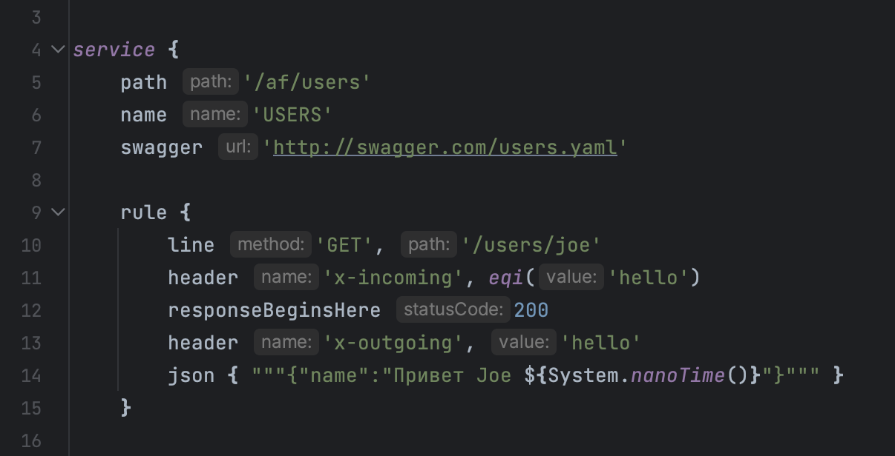

# Diesel Mocks

Write DSL mocks locally with the full assistance of IDE.
Serve them remotely with ease.

HTTP/REST supported now, more to come.

## Concept

- IDE-assisted rule editing
- Git-hosted rules
- server code and rules lives in the same git branch
- dynamic responses

## Example

## Reading

- [Groovy DSL](https://docs.groovy-lang.org/docs/latest/html/documentation/core-domain-specific-languages.html)
- [Hoverfly](https://specto.io/blog/2017/7/7/mocking-http-mockito-style/)
